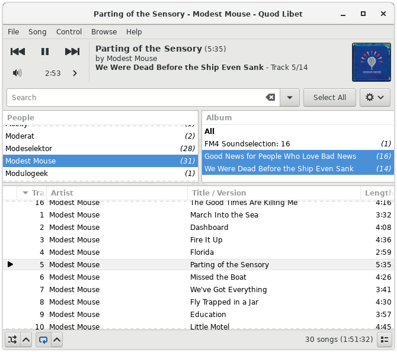

Paned Browser
=============

Overview
--------

The Paned Browser offers a convenient way to quickly drill down into a large
music collection, by narrowing  selections in several stages. Some users may
find this reminiscent of `RhythmBox <https://wiki.gnome.org/Apps/Rhythmbox>`_
or, to some extent, `iTunes <https://www.apple.com/uk/itunes/>`_.

In Quod Libet though, you can have as many panes as you want, grouped by 
any tags you want, for example the popular ''genre/artist/album'' and 
''artist/album'', or ''artist/album/part'', or  ''artist/album/artist'' in 
case you have a lot of multi-artist albums.

The songlist is presented at the bottom, and the panes, which run from left 
to right, are above. Clicking on an item (or items) in a pane will restrict 
it to just songs matching those (e.g. those artists, or dates, genres etc). 
This will update the counts and choices on the next pane, and the filtered 
results will be updated automatically in the song list.

Pane Configuration
------------------

To change the panes, click the *Preferences* button all the way to the 
right of the search bar. There you can choose between some popular setups 
or set up custom ones using the add and remove buttons. You can change the 
order of the panes by dragging them to the desired place.

Unlike elsewhere, multiple values per tag for a song are split into multiple
entries.  Tied tags also result in multiple entries.  Tag patterns take
multiple values from tags and from tied tags and produce multiple entries.

Entries are sorted using sort values for tags.  For tags with multiple
values, each value is paired with the corresponding value from the sort tag.
Quod Libet tries to do something reasonable when a value (e.g., "The
Beatles") sometimes has a sort value (e.g., "Beatles, The") and sometimes
does not or has a different sort values (e.g., "Beatles").

Examples
--------

+-------------------+-----------------------+
| Pattern           | Result                |
+===================+=======================+
| ``~performers``   | Julio Inglesias       |
+-------------------+-----------------------+
|                   | Frank Sinatra         |
+-------------------+-----------------------+

+--------------------------------------+--------------------------------+
| Pattern                              | Result                         |
+======================================+================================+
| ``<~year|<~year>. <title>|<title>>`` | 1993\. Summer Wind             |
+--------------------------------------+--------------------------------+

+--------------------------------------+--------------------------------+
| Pattern                              | Result                         |
+======================================+================================+
| ``~title~~performers``               | Julio Inglesias                |
+--------------------------------------+--------------------------------+
|                                      | Frank Sinatra                  |
+--------------------------------------+--------------------------------+
|                                      | Summer Wind                    |
+--------------------------------------+--------------------------------+

+---------------------------------------------------+------------------------+
| Pattern                                           | Result                 |
+===================================================+========================+
| ``<~year|<~performers> - <~year>|<~performers>>`` | Julio Inglesias - 1993 |
+---------------------------------------------------+------------------------+
|                                                   | Frank Sinatra - 1993   |
+---------------------------------------------------+------------------------+

Using Markup
^^^^^^^^^^^^

Also it's possible to change text emphasis using the `Pango markup language 
<https://developer.gnome.org/pango/unstable/PangoMarkupFormat.html>`_

=========================================================== =================================
Pattern                                                     Result
=========================================================== =================================
``<~year|\<b\>\<i\><~year>\</i\>\</b\> - <album>|<album>>`` **2011** - This is an album title
=========================================================== =================================

Aggregation
^^^^^^^^^^^

On the right side of each pane you can see the number of songs of each 
entry. This can be configured as well by adding a pattern/tag separated by 
``:`` (In case you want to use ``:`` in your pattern it has to be escaped using 
``\:``)

============================ ===========================
Pattern                      Result
============================ ===========================
``~~year~album:(<~rating>)`` 2011 - Album title     (♪♪)
============================ ===========================
