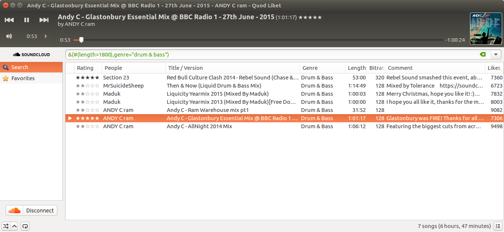

Soundcloud Browser
==================

*From v3.7*

Overview
--------

This browser lets you interact with `Soundcloud <http://soundcloud.com>`_
and play tracks from the millions on offer.
Where possible it aims to keep the look and feel as familiar and integrated to
the Quod Libet experience as possible.

Connecting your account
-----------------------
If you have an account, you can also access your favourites and rate songs.
To do so, click the Soundcloud connect button at the bottom right.

This will then take you to. If your operating system is configured to process
``quodlibet://`` URLs with Quod Libet (see `the instructions <https://quodlibet.github.io/callbacks/soundcloud.html?code=CODE_GOES_HERE>`_ given to you there) then
this process will happen automatically.

If not, you can copy the code from the web page that appears and click the QL button again to enter it.

Once you are logged, in you can log out by clicking the same button again,
now a disconnect button (seen in the screenshot).

Features
--------

Higher quality streams
^^^^^^^^^^^^^^^^^^^^^^

The Soundcloud browser will use the download URL, where available, for the highest quality stream.
Note this may require that you are logged in, and is usually *not* available.

Support for Quod Libet queries
^^^^^^^^^^^^^^^^^^^^^^^^^^^^^^

One of the more interesting features of the soundcloud browser is that it can
*translate* simpler queries in standard QL syntax to something that can work
across the web to a library that isn't yours.

Obviously, there are many limitations to this approach both conceptually and
due to its implementation, but nonetheless queries like ``&(#(length>300), title=dubstep)``
get (roughly) what you might expect.

Tags
^^^^

Supported tags
 * ``artist``, ``genre``, and ``title`` translate as you might imagine
 * ``website`` translates to Soundcloud's current URL for that track
 * ``~#rating`` is translated to 0.0 (not a Soundcloud favourite) or 1.0 (a Soundcloud favourite)
 * ``~#bitrate`` is the highest bitrate available when playing the track (normally 128)
 * ``~comments`` is translated to the track details.

New tags
 * ``~#favoritings_count`` and ``~#likes_count`` etc represent how often these tracks have been favorited / liked
   (note that there currently seem to be inconsistencies within Soundcloud itself as to how these are populated)
 * ``soundcloud_track_id`` is the soundcloud unique ID for the track.

Comments
^^^^^^^^
Comments in Soundcloud have been integrated to QL as read-only bookmarks, as
they are also time-specific text to do with a particular song. Unlike bookmarks
they have a lot more metadata (notably the user), so this is rendered as text.

To see them, access as you normally would bookmarks (e.g. view info, right-click the time widget or edit the bookmarks).

