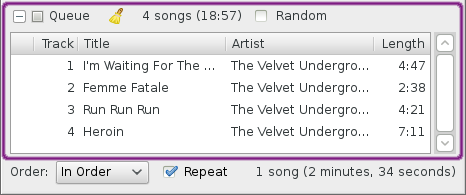
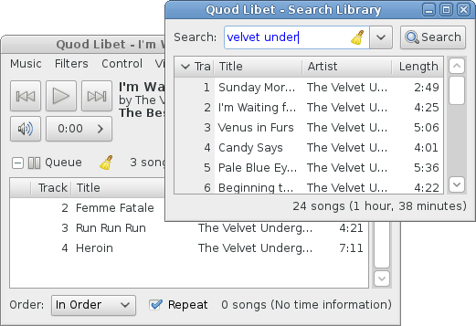
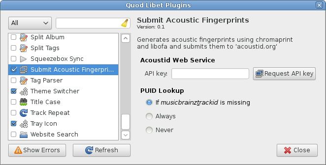

Overview
========

The Fundamentals
----------------

Explanation of the GUI elements
^^^^^^^^^^^^^^^^^^^^^^^^^^^^^^^

When you start up Quod Libet for the first time, and have configured your
library, it should look something a little like the screenshot here, which
is show with annotations. These are all explained below.

.. figure:: images/main_overview.png
    :align: right
    :width: 400px
    :figwidth: 400px

    A basic view of Quod Libet, and its GUI elements

1. Player Controls
^^^^^^^^^^^^^^^^^^

Provides buttons for seeking, changing volume and changing the currently played song.

By right-clicking, they also provide context menus with advanced options:

 * The volume button lets you choose the active replaygain mode
   (album, track, automatic).
 * The seek button can display the remaining instead of the elapsed time
   and provides options for interacting with bookmarks.
 * The context menu of the play button has an option to pause playback after
   the current song.

2. Current Song Information
^^^^^^^^^^^^^^^^^^^^^^^^^^^

Displays information about the currently playing song.

Again, the context menu contains more options, like rating and tag editing
for the current song.

There is also an entry called *Edit Display...* which lets you change
everything that is shown in that area, like the file format, bitrate, font
size etc. The syntax is the same as for :ref:`renaming files <RenamingFiles>`.

3. The Song List & Browser
^^^^^^^^^^^^^^^^^^^^^^^^^^

As the name suggests, the song list is a list of matching songs presented
by the current browser.   Double-clicking a song in the song list will start
playing it immediately.

The browser consists of a way to filter your
library (songs), e.g. a simple search or by a list of albums. In the image
above, no browser is active so only the current song list is shown. You can
change the active browser by selecting one in the *View* menu.

4. Playback Order
^^^^^^^^^^^^^^^^^

The active playback order affects the selection of the next song or what
happens if you manually switch to a new song.

Note that Play Order Plugins add to this list allowing QL new ways of
ordering songs, like following your selection or adding songs to the queue
instead of playing them immediately.

The *Repeat* checkbox can be used in conjunction with the playback orders,
to repeat the currently selected view of songs after all song have been
played or skipped.

It's important to note that the playback order will not affect the queue,
which has its own playback settings.

5. Song Information
^^^^^^^^^^^^^^^^^^^

The area in the bottom-right corner shows information about all songs in
the song list *or* about your song selection if more than one song is
selected.

It also shows progress information of background operations like importing
music.

The Queue
---------

The play queue and the song list determine what's played next. Unlike the 
song list the queue consumes songs (from the queue not your library) as 
they are played. That is, once a song starts playing it disappears from the 
queue.

The queue however, takes precedence whenever it has songs. After it's empty, 
playback will continue in the main song list where it left off.

To add songs to the queue, right-click and *Add to Queue*, use the shortcut
``CTRL+Return`` or select songs in a different browser window.

More Browsers
-------------

Besides the active browser in the main window, you can open as many
different browser windows as you want by selecting one under *Browse* >
*Open Browser* or in the tray icon plugin context menu.

In a separate browser, double-clicking a song will result in it being
added to the queue rather than played immediately (as per the main browser).

See the :ref:`Browsers Guide <Browse>` for full details on browsers and the
various implementations.

Example usage:

 * Manage playlists by dragging songs across browsers (eg Search browser to Playlist browser)
 * Edit the tags of some songs while the ones in the main song list get played etc.
 * Check out other songs by the artist currently playing without disturbing that list.

The Library
-----------

If all your music lives in one folder on your computer, adding your entire
music collection in Quod Libet is easy.

From the main menu bar, select *File* > *Add a Folder* and browse to the
top-most folder containing your music.  By default Quod Libet will scan
your selected folder recursively, adding all the songs found to your
library automatically. Add more folders if you wish.

Depending on the size of your music collection, it may take a few minutes
to perform the initial scan.

Plugins
-------

The image above shows the plugin manager, from where you can enable /
disable / configure all available plugins.
