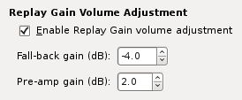

.. _replaygain:

Replay Gain
===========

`Replay Gain <https://en.wikipedia.org/wiki/Replay_Gain>`_ is a common 
standard for adjusting the loudness of songs/albums to the same level.

Quod Libet provides tools for analyzing songs, saving the calculated values 
in the song's metadata and adjusting the volume.

Audio Analysis
--------------

.. image:: images/replaygain_plugin.png
    :align: right
    :scale: 85%

For calculating replay gain values QL provides a replaygain plugin. Simply 
select some songs, or some albums and activate the replaygain plugin in the 
plugin submenu. The replaygain plugin has to go through every bit of song 
data so this can take some time.

After the analyzing part is finished you can save the calculated
values. They will be written into the song's metadata.

The replay gain plugin calculates a peak and a gain value for each song and
for each album. The *gain value* specifies how much the volume of the song
has to be adjusted so it equals the replay gain standard loudness level.
The *peak value* holds the value of the loudest (or highest amplitude in fact) part in the song/album. This
is needed because the range where the song volume can be increased is limited
and pushing the volume over it would lead to sound distortion, so called
"clipping". The calculated gain adjustments are relative to 89 dB.

To find out more about how the calculation is done, read the `detailed summary
<http://wiki.hydrogenaud.io/index.php?title=Replay_Gain_specification>`_ over
at the hydrogenaudio's knowledgebase. QL uses GStreamer for this operation, so
check out `rganalysis docs
<https://gstreamer.freedesktop.org/data/doc/gstreamer/head/
gst-plugins-good-plugins/html/gst-plugins-good-plugins-rganalysis.html>`_ for
more info.

Setting it up
-------------

Under *Music* > *Preferences* > *Player* you can activate replay gain 
adjustment.

There are two configuration options available:

*Fall-back gain* is the volume adjustment that gets used for songs with no 
replay gain tags (which have not been analyzed). Most audio files are 
rather high volume these days and the difference between an 89db song and an 
unadjusted song can be quite high (e.g. >9dB). So to avoid a sudden volume 
jump, try setting this value to the average gain adjustment in your library.

*Pre-amp gain* simply gets added to each song's gain value, i.e. it adjusts 
the default loudness level (89 db). The problem is though, that if it is 
too high, Quod Libet can't increase the volume for some songs because they 
would exceed the volume limit and cause clipping.

Applying volume adjustment
--------------------------

.. image:: images/replaygain_force.png
    :align: right

In Quod Libet the gain type is tied to the active browser and play order. 
The "Media Devices" and "Playlist" browsers will only use track gain. In 
all other browsers the "In Order" play order will switch on the album gain 
adjustment (it will fall back to track gain if there is no album gain). In 
"Shuffle" mode only the track gain gets applied.

It is possible to set the active gain type manually by right clicking on 
the volume slider button and choosing the type in the menu. The chosen gain 
type will then be active until Quod Libet is closed.

Querying existing Replay Gain values
------------------------------------

You can perform simple or complex searches (see SearchingGuide) using RG 
data. Here are a few useful ones:

Find *all files without track Replay Gain*:

    ``replaygain_track_gain=""``

Find *really loud albums* (best in AlbumListBrowser):

    ``#(tracks>5, replaygain_album_gain<=-11)``
