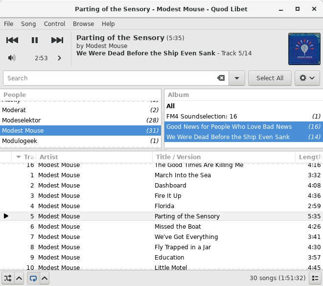
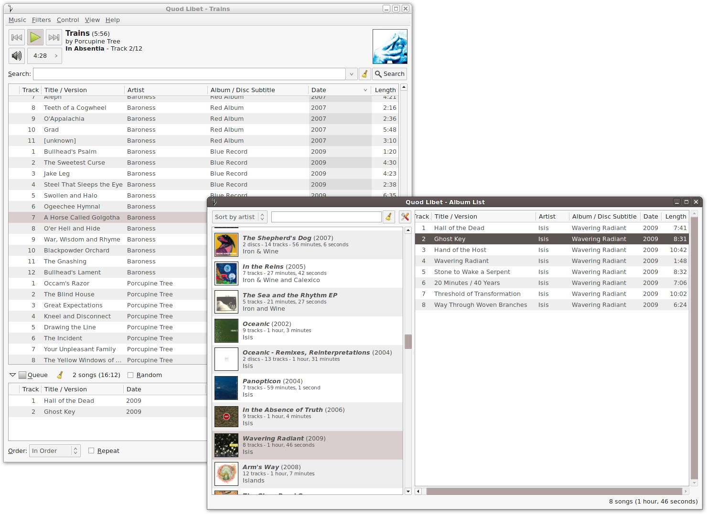
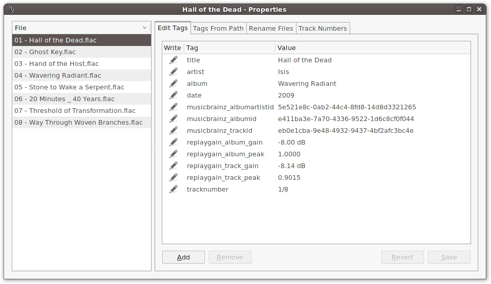
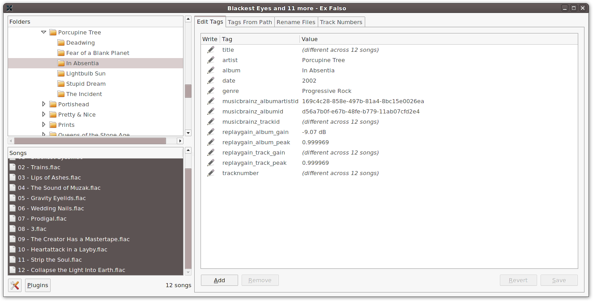
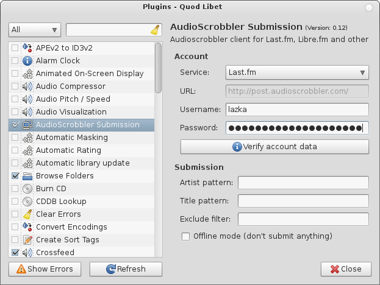

.. _Screenshots:

Screenshots
===========

    The paned browser, providing a customizable hierarchy of filters for finding your music

.. figure:: images/album-list-2017-08.png

    The album browser, giving a visual anchor for a large library

.. figure:: images/covergrid-plus-waveform-2017-08.png

    The cover grid browser, giving an even more visual anchor for libraries

.. figure:: images/soundcloud-browser-2017-08.png

    The Soundcloud browser.

    Quod Libet's queue in action, and its handling of multiple browser windows

    The powerful and feature-rich tag editor interface, shared by Quod
    Libet and Ex Falso, that gives you the freedom to tag your music how
    you see fit

.. figure:: images/tagrename.png

    Quod Libet and Ex Falso also share a powerful file-renaming system

    Ex Falso, the standalone tagging application

    Quod Libet and Ex Falso are highly extensible through many included
    plugins

